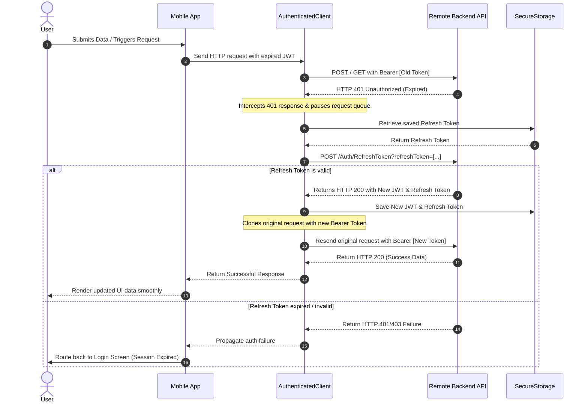

# 🏥 MediConnect — Comprehensive Project Features & Architecture Documentation

This is a comprehensive, standalone documentation file detailing the entire **MediConnect Mobile Client** features, user journeys, software architecture, and system design.

---

## 🗺️ Table of Contents
- [✨ Key Architectural Highlights](#-key-architectural-highlights)
- [👥 Actor Roles & Feature Matrix](#-actor-roles--feature-matrix)
  - [1. 🩺 Patient Portal](#1--patient-portal)
  - [2. 🥼 Doctor Panel](#2--doctor-panel)
  - [3. 💁 Receptionist Dashboard](#3--receptionist-dashboard)
  - [4. 🛡️ Admin Suite](#4--admin-suite)
- [🏗️ Directory Structure](#️-directory-structure)
- [🔗 API Integration & Session Persistence](#-api-integration--session-persistence)
- [🎨 Design System & Theming](#-design-system--theming)
- [🛠️ Tech Stack & Library Ecosystem](#️-tech-stack--library-ecosystem)
- [🚀 Quick Start & Installation](#-quick-start--installation)
- [👥 Meet the Dev Team](#-meet-the-dev-team)

---

## ✨ Key Architectural Highlights

*   **Role-Based Access Control (RBAC):** Customized dashboards, navigations, and actions dynamically rendered according to the logged-in user's role (`Admin`, `Doctor`, `Receptionist`, `Patient`).
*   **Automatic JWT Token Refresh Interceptor:** A custom-built `AuthenticatedClient` that intercepts `401 Unauthorized` API responses, requests a new JWT token using a stored refresh token, and seamlessly replays the failed request behind the scenes.
*   **Persistent Custom Theming:** Dynamically toggles between beautifully curated **Light** and **Dark** mode palettes utilizing a reactive state-driven singleton design.
*   **QR Scanner Verification:** Real-time appointment and check-in confirmation using embedded high-speed camera scanning.
*   **Network Status Awareness:** Integrated connection status monitoring to protect state transitions when offline.

---

## 👥 Actor Roles & Feature Matrix

### 1. 🩺 Patient Portal
Tailored for a seamless healthcare seeker experience, prioritizing accessibility and immediate service.
*   **Multi-Attribute Registration:** Comprehensive registration collecting physical indices (height, weight), emergency contacts, blood groups, and date of birth.
*   **Visual Home Hub:** Dynamic medical banners, specialization quick-selection grid, and curated doctor cards.
*   **Granular Doctor Search & Discovery:** Search and filtering by name, specialization, clinic fees, and average patient reviews.
*   **Interactive Booking Workflow:** Select-to-book calendar interface for reservation slots directly linking to doctor availability.
*   **Appointment Status Tracking:** Divided tabs for upcoming, pending, and archived appointments.
*   **Medical Record Archives & History:** View past consultation summaries, diagnosis logs, and historical clinic records.
*   **Profile Self-Management:** In-app editing of medical parameters, blood types, contact info, and profile pictures.

### 2. 🥼 Doctor Panel
Allows clinical practitioners to run their virtual practices and coordinate care without administrative overhead.
*   **Dedicated Doctor Landing Page:** Quick stats highlighting today's scheduled patient load.
*   **Pending Bookings Management:** Review patient booking requests with instant Accept, Reschedule, or Deny capabilities.
*   **Active Appointment Hub:** View real-time patient queue lists and chronological appointment schedules.
*   **Clinic Profile Customizer:** Edit medical background, biography, consultation pricing, specialization tags, and location.
*   **Practice Schedule Templates:** Tailor available weekly time frames and consultation hours dynamically.

### 3. 💁 Receptionist Dashboard
Engineered for hospital and clinic front-desk operations to expedite patient flows.
*   **Unified Front-Desk Operations:** Live dashboard listing incoming walk-ins and patient confirmations.
*   **QR Code Scanner:** Immediate validation of patient digital bookings at the reception desk via the device camera.
*   **Pending Verification Queue:** Approve or update appointment records based on verification status and fee payments.
*   **Front-Desk Profile Management:** Easily keep receptionist personal accounts up to date.

### 4. 🛡️ Admin Suite
The command center enabling platform supervisors to orchestrate operations, manage users, and view analytics.
*   **Analytical Dashboards:** Live-updating indicators showcasing platform stats, patient acquisition trends, active doctors, and transaction volumes.
*   **Advanced Analytics Engine:** Dedicated interactive graphs plotting earnings, patient cohorts, and clinic performance.
*   **Role Management (CRUD):** 
    *   **Manage Doctors:** Register new clinical practitioners, audit details, edit licenses, and delete accounts.
    *   **Manage Receptionists:** Seamlessly add, update, and manage clinic receptionists.
*   **Specialization Configurator:** Create, customize, and upload specialized medical divisions (e.g., Cardiology, Dermatology, Pediatrics) with corresponding iconography.
*   **Live Metrics Pages:** Customized standalone status panels for deep-diving into:
    *   *Today's Appointments* & *Today's Doctors*
    *   *Today's Revenue Metrics*
    *   *Total Registered Patients, Doctors, and Historic Bookings*
*   **QR Check-In Terminal:** Secondary administrator scanner interface for general check-ins.

---

## 🏗️ Directory Structure

The project code is organized strictly following modular, clean-code architecture principles to isolate logic, UI, and data models:

```yaml
lib/
├── main.dart                      # App entry-point with bindings, routing & boot logic
├── home_screen.dart               # Core host page routing users by role
├── constants/                     # Color constants, themes, and design tokens
│   ├── api_constants.dart         # API hosts and remote server configuration
│   ├── app_theme.dart             # Custom light and dark ThemeData configurations
│   ├── colors.dart                # Global theme color tokens
│   ├── shimmer_loading.dart       # Premium bone-shimmer loading effects
│   └── theme_ext.dart             # Extensions on BuildContext for quick styles
├── models/                        # Strictly typed plain-old Dart objects (JSON deserialization)
│   ├── AdminDashboardModel.dart   # Admin stats serialization model
│   ├── AppointmentModels.dart    # Clinic appointment scheduling parameters
│   ├── CreateDoctorModel.dart     # Doctor onboarding parameters
│   ├── SpecializationModel.dart   # Clinic categories model
│   └── ...                        # Core business models
├── auth/                          # User entry flows
│   └── screens/
│       ├── login_screen.dart      # Password-secured multi-role entry
│       └── register_screen.dart   # Patient multi-step signup screen
├── Patient/                       # Dedicated Patient features and screens
│   ├── doctor_details_page.dart   # Doctor profiles and feedback reviews
│   ├── screens/
│   │   ├── booking_screen.dart    # Calendar appointment slot selection
│   │   ├── appointments_page.dart # Patient's active appointment list
│   │   └── profile.dart           # Patient's medical ID card and configurations
│   └── widgets/                   # Specialized Patient UI elements
├── Doctor/                        # Dedicated Doctor features and screens
│   ├── doctor_appointments_page.dart # Managed schedules list
│   ├── doctor_home_screen.dart    # Doctor stats overview
│   └── edit_doctor_profile.dart   # Practice fee and info manager
├── Receptionist/                  # Dedicated front-desk operations
│   ├── receptionist_dashboard.dart # Operations landing page
│   ├── qr_scanner_page.dart       # Integrated QR scan validator
│   └── receptionist_pending_appointments_page.dart
├── Admin/                         # Platform operations control panels
│   ├── admin_dashboard.dart       # High-level stats, quick actions
│   ├── analytics_page.dart        # Financial, patient, and doctor analytics charts
│   ├── manage_doctors_page.dart   # Active doctor directory with search and edit
│   ├── qr_scanner_page.dart       # Admin check-in scanner
│   └── manage_specializations_page.dart # Categories dashboard
├── Services/                      # Application core services
│   ├── api_service.dart           # HTTP Client setup with AuthenticatedClient wrapper
│   ├── api_sections/              # Modularized API sub-services
│   │   ├── auth_api.dart          # Auth, verification OTPs, and password changers
│   │   ├── admin_api.dart         # Admin-only commands & analytics endpoints
│   │   ├── appointment_api.dart   # Reservation schedulers and queue endpoints
│   │   └── ...                    # Doctor, profile, and schedule API sections
│   ├── secure_storage.dart        # Keychain-level token saving
│   └── theme_service.dart         # Dynamic Light/Dark persistent theme service
└── Widgets/                       # Core shared design system controls
    ├── common_app_bar.dart        # Universal adaptive app bar
    └── password_strength_checker.dart # Real-time password safety analytics
```

---

## 🔗 API Integration & Session Persistence

MediConnect interacts dynamically with a highly secure RESTful backend api via the specialized `ApiService`.

### Token Interception & Auto-Refresh Workflow

The application leverages a robust `AuthenticatedClient` extending Dart's native `http.BaseClient` to automatically handle expired tokens. This provides a completely uninterrupted user experience.



---

## 🎨 Design System & Theming

The application defines a modern, premium design system featuring customized components, cohesive micro-interactions, smooth elevation overlays, and dual-theming properties:

### Custom Light Palette
*   **Background:** Crisp Slate Gray (`#F4F7FA`)
*   **Containers:** Pristine White (`#FFFFFF`) with thin, elegant borders (`#E2E8F0`)
*   **Primary Accent:** Corporate Navy Blue (`#0D47A1`)
*   **Primary Text:** Charcoal Navy (`#1E293B`)
*   **Secondary Text:** Slate Gray (`#475569`)

### Premium Dark Palette
*   **Background:** Deep Midnight Navy (`#111827`)
*   **Containers:** Card Dark Slate (`#1E2235`) with subtle borders (`#374151`)
*   **Primary Accent:** Neon Sky Blue (`#4A90D9`)
*   **Primary Text:** Ice White (`#F1F5F9`)
*   **Secondary Text:** Muted Lavender (`#94A3B8`)

---

## 🛠️ Tech Stack & Library Ecosystem

MediConnect utilizes the best Dart and Flutter libraries to achieve peak performance, security, and utility:

| Package | Purpose | Category |
| :--- | :--- | :--- |
| **`flutter`** | Mobile UI cross-platform engine | SDK |
| **`http`** | Highly-customizable network REST client with request cloning capabilities | Networking |
| **`jwt_decoder`** | Local verification and token validity checks | Security |
| **`flutter_secure_storage`**| iOS Keychain & Android KeyStore encrypted storage for JWT credentials | Security / Storage |
| **`shared_preferences`** | Lightweight, high-speed key-value storage for theme states and user roles | Local Storage |
| **`mobile_scanner`** | High-performance, camera-based QR and barcode analytics scanner | Scanning |
| **`qr_flutter`** | Programmatic vector QR code generation (for patient booking tickets) | Utilities |
| **`shimmer`** | Elegant content loading animations for slow networking | UX Enhancement |
| **`connectivity_plus`** | Live offline detection and dynamic network tracking | System |
| **`intl`** | Comprehensive local calendar scheduling and currency formats | Localization |

---

## 🚀 Quick Start & Installation

### Prerequisites
Make sure you have the following software packages installed on your local computer:
*   [Flutter SDK](https://docs.flutter.dev/get-started/install) (v3.10.0 or higher recommended)
*   [Dart SDK](https://dart.dev/get-started) (v3.0.0 or higher)
*   Xcode (for iOS simulators and devices) or Android Studio / SDK (for Android simulation)

### 1. Clone & Navigate
```bash
git clone https://github.com/moaazali3/mediconnect.git
cd mediconnect
```

### 2. Fetch Dependencies
Install all package dependencies configured in `pubspec.yaml`:
```bash
flutter pub get
```

### 3. Generate App Icons (Optional)
Generate Android/iOS launcher icons using the preset configurator:
```bash
flutter pub run flutter_launcher_icons
```

### 4. Running the Project
Launch the app in debug mode on your connected simulator or physical testing device:
```bash
flutter run
```

---

## 👥 Meet the Dev Team

Our multi-disciplinary team is proud to bring you MediConnect:

*   📱 **Frontend & Flutter Integration:**
    *   **Moaaz Ali**
    *   **Mustafa Amr**
    *   **Ahmed Gohar**
*   💻 **Backend Systems development (.NET):**
    *   **Youssef Ahmed**

---
*This document contains the private comprehensive feature specification list and engineering architectures of the MediConnect platform.*
